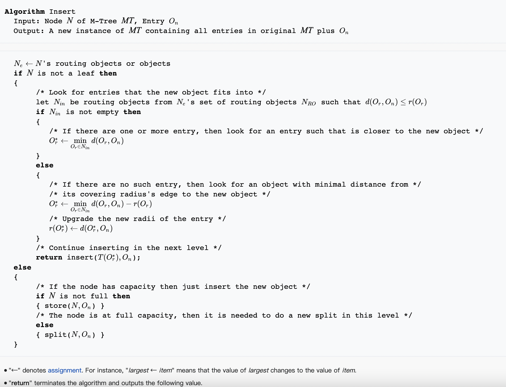

reference from wikipedia:

[en.wikipedia.org](https://en.wikipedia.org/wiki/M-tree)

# M-Tree的插入 Insert:

  在这一节描述M-tree的插入过程。插入过程需要将一个数据插入到对应的叶节点当中（同样地，叶节点只能存放0-M个数据）。
从根节点开始，找到插入数据对应的叶节点有以下关键思路：

如上述图片中的伪代码所示，其大致思路为找到正确的孩子节点并插入

- 找到正确的孩子结点（最小范围扩大）

  - 计算每个孩子结点的圆心值和插入数据的距离dist。

  - 如果存在dist小于某些孩子结点的半径（这意味着插入带点不用扩大结点的半径），则选择最小dist对应的孩子结点。

  - 若不存在，选择dist减去半径最小的孩子结点作为结果。

- 叶节点插入判断

  - 到达叶节点后，若叶节点未满，则直接将数据插入。

  - 若叶节点满了，则需要将结点进行分裂。

  

Tips：

- 可以并行化的地方：

  - 计算圆心距离小于半径的一个set 并找到最小的（排序算法）

# M-Tree的分裂 Split

对于一个满的结点，我们需要将它分裂成两个结点。然后孩子结点按一定方式分配到两个结点中，修改父节点的指针，使其指向两个结点。

# 使用M-Tree进行range搜索

range搜索的关键思路是：找到和查询数据相交的圆

- 对于每个孩子结点，如果它的圆心值和查询目标的距离小于搜索半径，则递归地搜索这个孩子结点。

- 到达叶节点后，验证数据和查询目标的距离是否小于搜索半径，小于则加入搜索结果集中。

- **对每个孩子结点计算它的圆心值和查询目标的距离是一个不小的开销，特别是维度增大时。使用三角不等式估算出距离的下界，如果该下界大于搜索半径+当前结点的范围，那么查询目标的搜索区域一定不在该孩子结点。**

部分内容来自CSDN Blog：[https://blog.csdn.net/m0_37710845/article/details/110368677](https://blog.csdn.net/m0_37710845/article/details/110368677)

